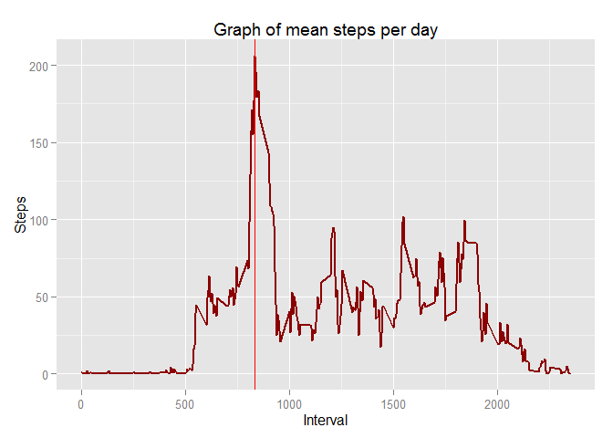

# Reproducible Research: Peer Assessment 1
Aleš Juvančič  
08. december 2015  

## Introduction

It is now possible to collect a large amount of data about personal movement using activity monitoring devices such as a Fitbit, Nike Fuelband, or Jawbone Up. These type of devices are part of the “quantified self” movement – a group of enthusiasts who take measurements about themselves regularly to improve their health, to find patterns in their behavior, or because they are tech geeks. But these data remain under-utilized both because the raw data are hard to obtain and there is a lack of statistical methods and software for processing and interpreting the data.

This assignment makes use of data from a personal activity monitoring device. This device collects data at 5 minute intervals through out the day. The data consists of two months of data from an anonymous individual collected during the months of October and November, 2012 and include the number of steps taken in 5 minute intervals each day.
Loading and preprocessing the data 


```r
# Initial load
library(data.table)
library(lubridate)
library(ggplot2)
library(knitr)
library(dplyr)
opts_chunk$set(echo = TRUE)
```

The data set is loaded from URL and processed in data table. We use lubridate package to format the date in dataset. 


```r
temp <- tempfile()
file.url <- 'https://d396qusza40orc.cloudfront.net/repdata%2Fdata%2Factivity.zip'
download.file(file.url,temp)
unzip(temp,'activity.csv',overwrite=TRUE)
unlink(temp)

activity <- fread('activity.csv')
activity$date <- ymd(activity$date)
head(activity)
```

```
##    steps       date interval
## 1:    NA 2012-10-01        0
## 2:    NA 2012-10-01        5
## 3:    NA 2012-10-01       10
## 4:    NA 2012-10-01       15
## 5:    NA 2012-10-01       20
## 6:    NA 2012-10-01       25
```

The variables included in this dataset are:

* steps: Number of steps taking in a 5-minute interval (missing values are coded as NA)
* date: The date on which the measurement was taken in YYYY-MM-DD format
* interval: Identifier for the 5-minute interval in which measurement was taken


## What is the mean number of steps taken per day?

For this part of the assignment, we can ignore the missing values in the dataset.

To calculate the total number of steps taken per day we first filter out all the NA values and sum the steps, grouped by date. The data is used for plotting of the histogram. 

Mean and median values are calculated based on the same data, with NA's ignored and the values are marked on the same plot as vertical lines. 


```r
sumStepsPerDay <- activity[!is.na(steps),.(sumSteps=sum(steps)),by=date][order(date)]
meanSumStepsPerDay <- mean(sumStepsPerDay$sumSteps)
medianSumStepsPerDay <- median(sumStepsPerDay$sumSteps)
head(sumStepsPerDay)
```

```
##          date sumSteps
## 1: 2012-10-02      126
## 2: 2012-10-03    11352
## 3: 2012-10-04    12116
## 4: 2012-10-05    13294
## 5: 2012-10-06    15420
## 6: 2012-10-07    11015
```

```r
ggplot(sumStepsPerDay, aes(x = sumSteps)) +
  geom_histogram(fill='darkred', binwidth=1000) +
  labs(title='Histogram of Steps per day', x='Steps per day', y='Frequency') +
  geom_vline(xintercept=meanSumStepsPerDay, color='red', size=1) +
  geom_vline(xintercept=medianSumStepsPerDay, color='blue', size=1)
```

 

Based on the data, the mean total number of steps take per day is 10766.19 steps and median total number of steps taken per day is 10765 steps.


## What is the average daily activity pattern?

To show the average daily activity pattern we make a time series plot of the 5-minute interval (x-axis) and the average number of steps taken, averaged across all days (y-axis).

In data set we use the function **which.max** to find the maximum value of steps per interval and to define the interval which has the largest amount of average steps. 


```r
meanStepsByInterval <- activity[!is.na(steps),.(meanSteps=mean(steps)),by=interval][order(interval)]
head(meanStepsByInterval)
```

```
##    interval meanSteps
## 1:        0 1.7169811
## 2:        5 0.3396226
## 3:       10 0.1320755
## 4:       15 0.1509434
## 5:       20 0.0754717
## 6:       25 2.0943396
```

```r
maxMeanStepsByInterval <- meanStepsByInterval[which.max(meanStepsByInterval$meanSteps)]

ggplot(meanStepsByInterval,aes(x=interval,y=meanSteps)) +
    geom_line(col='darkred',size=1) +
    labs(title='Graph of mean steps per day', x='Interval', y='Steps') +
    geom_vline(xintercept=maxMeanStepsByInterval$interval,color='red')
```

 

As can be seen from the plot and from the calculation, the interval 835 has the highest number of steps: 206.1698113. 


## Inputing missing values

We can see that there are a number of days/intervals where there are missing values (coded as NA). The presence of missing days may introduce bias into some calculations or summaries of the data.

The total number of missing values in the dataset (i.e. the total number of rows with NAs) is 2304. 

To eliminate the missing values in the dataset we used the average number of steps on specific week day (eg. 'Monday', 'Tuesday',...) **AND** specific interval inside that day. 

So we create a new dataset that is equal to the original dataset but with the missing data replaced by mean values of steps, grouped by week day and interval. To achieve this we used functions in *lubridate* package. 


```r
meanStepsByWDayInterval <- activity[!is.na(steps),mean(steps),by=.(wday(date),interval)]
activityNA <- activity[is.na(steps),.(steps,date,interval,wday=wday(date))]
activityNNA <- left_join(activityNA,meanStepsByWDayInterval,by=c('wday','interval')) %>% select(steps=V1,date,interval)
activityClean <- data.table(bind_rows(activity[!is.na(steps)],activityNNA))
head(activityClean)
```

```
##    steps       date interval
## 1:     0 2012-10-02        0
## 2:     0 2012-10-02        5
## 3:     0 2012-10-02       10
## 4:     0 2012-10-02       15
## 5:     0 2012-10-02       20
## 6:     0 2012-10-02       25
```

In a new histogram of the total number of steps taken each day we can see that there are slight differences from the estimates from the first part of the assignment.


```r
sumStepsPerDayClean <- activityClean[,sum(steps),by=date][order(date)]
setnames(sumStepsPerDayClean,c('Date','sumSteps'))
meanSumStepsPerDayClean <- mean(sumStepsPerDayClean$sumSteps)
medianSumStepsPerDayClean <- median(sumStepsPerDayClean$sumSteps)
     
ggplot(sumStepsPerDayClean, aes(x = sumSteps)) +
  geom_histogram(fill='darkgreen', binwidth=1000) +
  labs(title='Histogram of Steps per day', x='Steps per day', y='Frequency') +
  geom_vline(xintercept=meanSumStepsPerDayClean, color='red', size=1) +
  geom_vline(xintercept=medianSumStepsPerDayClean, color='blue', size=1)
```

 

The impact of imputing missing data on the estimates of the total daily number of steps is that the mean total number of steps taken per day is 10821.21 steps and median total number of steps taken per day is 11015 steps and so the numbers are higher.  


## Are there differences in activity patterns between weekdays and weekends?

To analize the differences we have to expand the data with two levels – 'weekday' and 'weekend' indicating whether a given date is a weekday or weekend day. To achieve this we use the *data.table* function. 


```r
activityClean[wday(date)%in%c(1,7),weekend:='weekend']
activityClean[wday(date)%in%c(2:6), weekend:='weekday']
head(activityClean)
```

```
##    steps       date interval weekend
## 1:     0 2012-10-02        0 weekday
## 2:     0 2012-10-02        5 weekday
## 3:     0 2012-10-02       10 weekday
## 4:     0 2012-10-02       15 weekday
## 5:     0 2012-10-02       20 weekday
## 6:     0 2012-10-02       25 weekday
```

```r
meanStepsByWeekend <- activityClean[,.(meanSteps=mean(steps)),by=.(weekend,interval)]
head(meanStepsByWeekend)
```

```
##    weekend interval  meanSteps
## 1: weekday        0 2.31071429
## 2: weekday        5 0.45000000
## 3: weekday       10 0.17500000
## 4: weekday       15 0.20000000
## 5: weekday       20 0.08888889
## 6: weekday       25 1.56388889
```

We also calculate the mean number of steps based on the new levels. Then we calculate the average steps in the 5-minute interval and plot the data with *ggplot* separately for weekdays and weekends. 


```r
meanMeanStepsLine <- activityClean[,.(meanSteps=mean(steps)),by=.(weekend)]

ggplot(meanStepsByWeekend, aes(x=interval, y=meanSteps, col=weekend)) + 
    geom_line(size=1) + 
    facet_wrap(~weekend, ncol=1) +
    geom_hline(data=meanMeanStepsLine, aes(yintercept=meanSteps)) +
    geom_hline(data=meanMeanStepsLine, aes(yintercept=meanSteps))
```

 

As can be seen from the plot, there are obvious differences in data on weekdays and weekends. The test subject is more active on weekday's morning hours and afternoon weekend hours. There are also obvious differences in evening activity where weekend activity is higher. 
Also, the average number of steps is higher during weekends - 43.078373 steps, compared to average number of steps during weekdays - 35.6164076 steps. 

